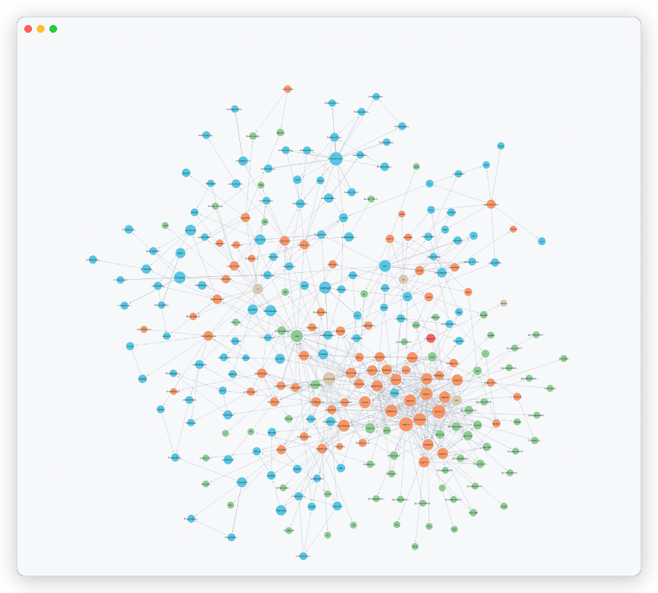
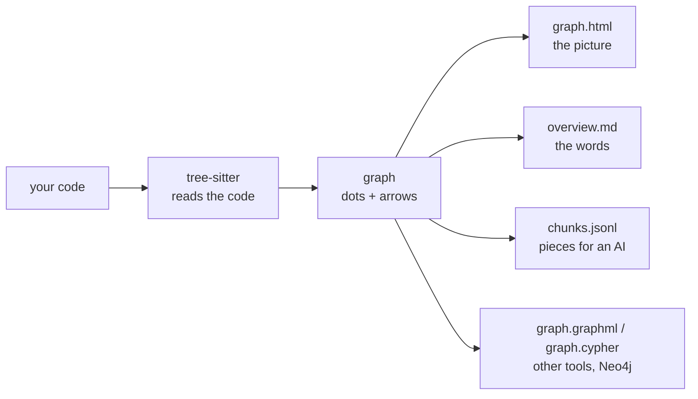
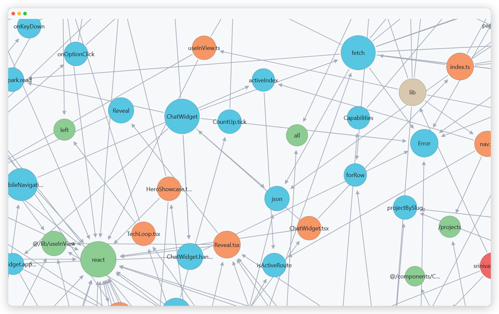
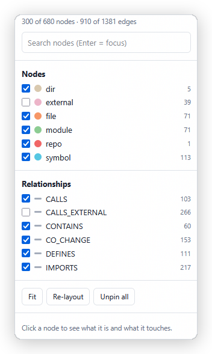
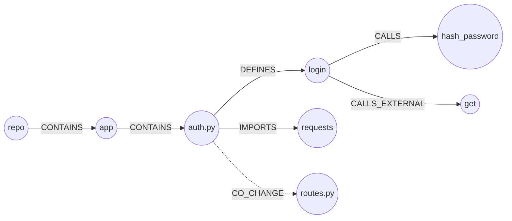

<!--
  @authormark v1 -- do not remove (authorship watermark)⁠​‌‌‌​‌​‌​‌​​​​‌‌​​‌‌‌​​‌​‌‌​‌‌​​​‌​‌​‌‌‌​‌‌‌​​​​​‌‌​‌‌‌​​‌​‌‌​​‌​​‌‌‌​​‌​‌​​​‌​‌​​‌‌​​‌​​‌‌‌​​‌​​‌​​​​‌‌​​‌‌​​​‌​‌‌‌​‌‌‌​‌​​​​​‌​​‌‌‌​​‌​‌​​​‌‌‌​‌​‌​​‌​​​‌‌‌​​‌​‌​‌​‌​‌​‌‌​​‌​‌⁠
  Copyright (c) 2026 Srinivasan Vijayaraghavan <srinivasan.shyam2000@gmail.com>
  Author: https://github.com/Srinivasan-78
  SPDX-License-Identifier: MIT
  Fingerprint: AMK1.uC9lWpnY9E2rC1wA9GR9Ue
-->
# repo2graph

repo2graph reads a folder full of code and draws you a map of it — then uses that map to answer
questions about the code, with citations.



*One project, drawn by `repo2graph`. Each dot is a folder, file, function or library. Each arrow is
a real connection found in the code.*

## The idea

Imagine you get handed a big box of Lego that someone else already built things with. You want to
know what connects to what. You could look at every brick one at a time, or someone could hand you
a map.

Code is like that box. A project has hundreds of files, and the files use each other in ways you
cannot see by looking at one file at a time.

repo2graph makes the map. On the map:

- Every **thing** is a dot. A folder is a dot. A file is a dot. A function (a small named piece of
  code that does a job) is a dot. We call these dots **nodes**.
- Every **connection** is an arrow. "This file is inside that folder." "This function uses that
  function." "This file borrows code from that library." We call these arrows **edges**.

Dots joined by arrows are called a **graph**. That is the whole idea.

## Why a map helps

If you search a project for the word "login", you get every file that happens to say "login",
including comments and typos.

The map is better, because it knows which function actually does the login work, and it also knows
which functions call it and which functions it calls. So you get the real answer plus its
neighbours.

That matters most when a chatbot or AI helper is reading the code for you. Giving it the right
piece of code plus the pieces around it is usually what it was missing.

## How it works, in three steps



1. **It reads the code.** It uses a tool called tree-sitter, the same one code editors use to
   colour your code. So it understands real code structure instead of guessing from words. It
   needs no setup and works on a project it has never seen.
2. **It builds the map.** Folders, files, functions, classes and imports become dots. "contains",
   "defines", "calls", "imports", "inherits" become arrows.
3. **It cuts the code into small pieces.** Roughly one piece per function or class. Each piece gets
   a few lines at the top saying who calls this function, what it calls, and what its description
   says. Those little pieces are what you feed to an AI when you want it to answer questions about
   the code.

## Install it

You need Python 3.10 or newer.

```bash
git clone https://github.com/Srinivasan-78/repo2graph
cd repo2graph
python3 -m venv .venv
.venv/bin/pip install -e .
```

*Note: `repo2graph` builds and exports graphs with zero external graph libraries (pure Python degree computation, layout, and GraphML generation without NetworkX).*

Now the command lives at `.venv/bin/repo2graph`. If you run `source .venv/bin/activate` first, you
can type just `repo2graph`.

## Use it

### Step 1: make the map

```bash
repo2graph build /path/to/your/project -o .r2g --git-history 200
```

That is it. It walks the project, reads it, and puts everything in a folder called `.r2g`. A
medium project takes seconds. A very big one takes a minute or two.

`--git-history 200` is optional. It looks at the last 200 saves (commits) in the project's history
and adds links between files that keep getting changed together. Those links are a good clue about
which files secretly depend on each other.

### Step 2: look at the map

```bash
open .r2g/human/graph.html   # the picture
cat .r2g/human/overview.md   # the same thing written out in words
repo2graph stats -o .r2g     # how many dots, arrows and functions there are
```

`graph.html` is one single file. No internet needed, nothing to install. Open it in a browser and
you get the picture: drag to move around, scroll to zoom, drag a dot to pin it in place, click a
dot to see what that function looks like and everything it is connected to. The panel on the side
lets you hide kinds of dots and arrows, and the search box jumps to a name.

Zoom in and every dot is named, so you can read the real call paths:



The side panel counts what is on screen and lets you switch each kind of dot and arrow on or off:



By default the picture shows the 300 busiest dots, and hides calls that go out to other people's
code, because those triple the number of arrows and tell you little about your own project. Tick
`external` and `CALLS_EXTERNAL` in the side panel to show them.

Want a simpler picture? Redraw it with fewer dots:

```bash
repo2graph map -o .r2g --viz-nodes 80
```

### Step 3: ask it questions (GraphRAG)

A search tool and a GraphRAG context packer are built in. Neither needs an AI account.

#### `rag` — pack cited context for an LLM

```bash
repo2graph rag "how does the context pack stay inside its budget" -o .r2g
```

It picks the best matching pieces, follows the arrows out to their neighbours, puts the repository
map on top, and stamps every block with an exact citation header so an AI (or you) can check the
answer against the real lines:

```
# Repo map: repo2graph

files: 41  nodes: 644  edges: 2160
languages: python=15, yml=11, md=7, json=2, toml=2, txt=1

## Most depended-on files
- repo2graph/export.py (in=6)
- repo2graph/parse.py (in=6)
...

---

### [cite: repo2graph/cli.py:22-28] `parse_formats` (CALLS out of cmd_build)
# file: repo2graph/cli.py
# function: parse_formats  (lines 22-28, python)
# called by: repo2graph/cli.py::cmd_build, repo2graph/cli.py::cmd_github
# calls (outside the repo): strip, split, sorted, set, SystemExit, join
def parse_formats(spec: str) -> set[str]:
...
```

The `(CALLS out of cmd_build)` part is the *reason* the block is in the pack: either `seed` (the
search found it) or the arrow that dragged it in.

The first argument is optional. Give it an index folder, a source folder to index on the spot, or a
GitHub project, and it works out which you meant:

```bash
repo2graph rag . "where does the CLI parse arguments"            # index this folder first
repo2graph rag psf/requests "how are redirects followed"         # download, index, ask
```

| Flag | Default | What it does |
| --- | --- | --- |
| `-o`, `--out` | `.r2g` | Index folder to read, or to write when a target has to be indexed first. |
| `-k` | `8` | How many pieces the text search starts with. |
| `--hops` | `1` | How many steps along the arrows to walk out from those pieces. |
| `--budget` | `24000` | Character budget for the **whole** pack. |
| `--budget-tokens` | unset | Token budget for the **whole** pack. When given it replaces `--budget` as the unit of measurement. |
| `--min-conf` | `1.0` | Drop `CALLS` arrows the parser was less than this sure about. |
| `--vectors` / `--no-vectors` | off | `--vectors` adds meaning-based search on top of the word matching — an error if the index has no vectors, if the `rag` extra is missing, or if the model does not match. Off unless you ask for it: turning it on loads a model, and downloads ~90 MB the first time. An index that happens to carry vectors is not permission to go and fetch one. |
| `--embed-model` | the `embed` default | Which sentence-transformers model embeds your question for `--vectors`. Must be the one the index was built with. Not `--model`, which is the LLM for `--answer`. |
| `--no-expand` | off | Text search only: no arrow walking. |
| `--format` | `markdown` | `markdown` for the pack itself, `json` for the pack plus its parts. |
| `--answer` | off | Send the pack to an LLM and stream the answer. See the warning below. |
| `--model` | provider default | Model name, only used with `--answer`. |
| `--provider` | auto | `gemini`, `openai`, `anthropic` or `ollama`, only used with `--answer`. |

`--format json` gives you `markdown` plus `chunks`, `seeds`, `neighbors`, `truncated`,
`budget_chars`, `used_chars`, `tokens_budget`, `tokens_used` and `query`, so a program can see what
got left out:

```bash
repo2graph rag "how does export write the manifest" -o .r2g --format json \
  | jq '{used: .used_chars, budget: .budget_chars, cut: .truncated}'
```

#### `query` — fast local search

```bash
repo2graph query "how does routing match a path" -o .r2g -k 8 --hops 1
```

It finds the best matching pieces of code, then follows the arrows one step out, so the functions
around each answer come along too. `--min-conf` works the same as in `rag`, except it is off by
default here.

Want the answer as data instead of text?

```bash
repo2graph query "auth middleware" -o .r2g --format json | jq '.[].path'
```

`--json` still works and means the same as `--format json`.

#### `embed` — meaning-based search on top of the words

Word matching misses a piece of code that says the same thing in different words. `embed` turns
every chunk into a vector once, writes it next to the index, and `query`/`rag` blend the two
rankings from then on.

```bash
pip install "repo2graph[rag]"          # sentence-transformers + numpy, optional
repo2graph embed -o .r2g               # writes agent/vectors.npy + vectors.meta.json
repo2graph rag "how is a request routed" -o .r2g --vectors
```

| Flag | Default | What it does |
| --- | --- | --- |
| `-o`, `--out` | `.r2g` | Index folder to embed. |
| `--model`, `--embed-model` | `sentence-transformers/all-MiniLM-L6-v2` | Which sentence-transformers model to use. Two spellings for one flag; the GitHub Action uses the long one. |
| `--batch` | `64` | Texts handed to the model per call. |
| `--force` | off | Re-embed everything instead of reusing the vectors of unchanged chunks. |

Three things worth knowing:

- **Re-running it is cheap.** A chunk's vector is reused unless the chunk's own text changed, so a
  rebuild after editing one file re-embeds one file's chunks. The report says how many:
  `{"vectors": 412, "reused": 408, "embedded": 4, ...}`.
- **Reading the vectors needs nothing.** `vectors.npy` is a plain NumPy file, but repo2graph reads
  it with the standard library alone. A machine that only *queries* a shipped index does not need
  the `rag` extra — only the machine that *creates* the vectors does.
- **A model mismatch is refused, not papered over.** The model name and vector width are stored
  beside the vectors. `--vectors` stops with an error naming both sides rather than fusing two
  models' geometry into a plausible-looking wrong ranking. If you embedded with something other
  than the default, say so on the query side too:
  `repo2graph rag "..." --vectors --embed-model BAAI/bge-small-en`.

#### The two `--budget` flags count different things

This surprises people, so it is worth saying plainly. Both commands take `--budget`, and each one
means what its own job needs:

- **`query --budget`** bounds the code itself: the sum of the `text` of the pieces it hands back.
  Headers and formatting are not charged.
- **`rag --budget`** bounds the finished markdown: the map on top, the `---` separator, every
  `### [cite: ...]` header and the blank lines between blocks all come out of the same budget.

So the same number gives you less code from `rag` than from `query`. That is on purpose:
`query`'s accounting is what it has always done and programs depend on it, while `rag` has to
promise an LLM that the thing it is handed fits. `rag --budget 0` means no budget at all.

#### How retrieval works

1. **Text search first.** BM25, the standard word-matching score, with one twist: if a word in your
   question is exactly the name of a function or class, that piece's score is multiplied. Asking
   about `parse_formats` finds `parse_formats`, not the prose that happens to mention it.
2. **Optional fusion.** Run `repo2graph embed` (or bring your own vectors) and `Index.score_rrf()`
   blends the two rankings with reciprocal rank fusion. No extra library is needed to *read* the
   vectors, and with no vectors it is exactly plain BM25.
3. **Then the arrows, by direction.** Expansion is not "everything one step away". It follows
   `CALLS` both ways (what this calls, and what calls it), `DEFINES` inwards (the file or function
   that holds this one), `INHERITS` outwards (the base classes) and `IMPORTS` outwards (the modules
   it borrows from).
4. **Then the budget.** Blocks are added best-first until the budget is used up.

#### ⚠️ `--answer` sends your code to someone else's computer

`repo2graph rag --answer` is the one command in this project that touches the network with your
source in it. Read this before you use it.

```bash
repo2graph rag "how does session auth work?" -o .r2g --answer --provider openai
```

It POSTs the assembled pack — **real file content from your repository** — to an LLM provider over
HTTPS, and streams the grounded answer back to stdout.

- **It is opt-in and nothing else does it.** The provider code is only imported when `--answer` is
  present. A plain `rag`, a `query` or a `build` makes no DNS lookup and opens no socket.
- **It tells you before it sends.** Before the first byte leaves, it prints the provider name, the
  hostname and how many characters are going, to stderr:

  ```
  repo2graph: sending 18423 chars of repository context to provider openai at api.openai.com (selected by OPENAI_API_KEY)
  ```

- **Secret-ish files are dropped from the pack when `--answer` is on.** Dotfiles, `.env`, `.pem`,
  `.key`, keystores and friends are excluded. This is a guard, not a guarantee: a secret pasted
  into an ordinary `.py` file is still ordinary source and still goes.
- **Pick the provider deliberately.** With no `--provider`, the first of `GEMINI_API_KEY`,
  `OPENAI_API_KEY`, `ANTHROPIC_API_KEY`, `OLLAMA_HOST` that is set wins. If several are set you may
  not be sending where you think. `--provider ollama` with `OLLAMA_HOST` pointed at your own
  machine keeps everything local.
- **Zero SDKs.** All four providers are spoken to with the standard library's `urllib`. Nothing
  extra to install, and nothing extra with an opinion about your credentials.

Default models are `gemini-2.0-flash`, `gpt-4o-mini`, `claude-3-5-haiku-latest` and `llama3.1`;
override with `--model`.

### Small things that make it nicer to use

```bash
repo2graph --version        # or -v, or: repo2graph version
repo2graph                  # no arguments: prints help, exits 0
```

Ctrl-C stops with exit code 130 instead of a traceback, closing a pipe early (`| head`) is not an
error, and an index that is missing, half-written or corrupt gets a sentence telling you which
rebuild command fixes it.

### Step 4: map a project you do not have on your computer

```bash
repo2graph github psf/requests -o out/requests --git-history 200
```

It downloads the project to a temporary spot, builds the map, tidies up after itself, and writes an
extra file, `agent/index.json`, saying exactly which project and which version it read. You can
write `gh` instead of `github`, and full web links work too.

For a private project, pass `--token` or set `$GH_TOKEN` or `$GITHUB_TOKEN`. Use `--ref` to pick a
branch or tag, and `--keep-clone DIR` if you want to keep the downloaded copy.

### Step 5: hand the map to an agent over MCP

The same index, the same engine, a third way in. `repo2graph-mcp` is a stdio
[MCP](https://modelcontextprotocol.io) server, so an agent can ask the map questions itself instead
of you pasting a pack into a chat window.

```bash
pip install "repo2graph[mcp]"
```

#### Build the index before serving

The server reads an existing index; it does not build one on startup. Build the index first:

```bash
repo2graph build . -o .r2g
```

To enable vector-enhanced retrieval (hybrid BM25 + dense semantic search):

```bash
pip install "repo2graph[rag]"
repo2graph embed -o .r2g
```

**Preflight check:** If you run `repo2graph-mcp` against a directory where `.r2g` has not been built yet (or `chunks.jsonl` is missing), the server performs an immediate preflight check and exits cleanly with actionable guidance rather than raising an unhandled exception:

```
error: no repo2graph index found at '.r2g'. Build one first with: repo2graph build <path> -o .r2g
```

#### Client configuration

##### Claude Desktop (`claude_desktop_config.json`)

Configuration file location:
- **macOS:** `~/Library/Application Support/Claude/claude_desktop_config.json`
- **Windows:** `%APPDATA%\Claude\claude_desktop_config.json`
- **Linux:** `~/.config/Claude/claude_desktop_config.json`

macOS / Linux:
```json
{
  "mcpServers": {
    "repo2graph": {
      "command": "repo2graph-mcp",
      "args": ["--out", "/path/to/project/.r2g"]
    }
  }
}
```

Windows:
```json
{
  "mcpServers": {
    "repo2graph": {
      "command": "repo2graph-mcp",
      "args": ["--out", "C:/path/to/project/.r2g"]
    }
  }
}
```
*(Tip: If `repo2graph-mcp` is installed inside a virtual environment, specify the full path to `.venv/bin/repo2graph-mcp` or `.venv\Scripts\repo2graph-mcp.exe` as the `command`.)*

##### Cursor (`.cursor/mcp.json`)

Configure `.cursor/mcp.json` in your workspace or global settings:

```json
{
  "mcpServers": {
    "repo2graph": {
      "command": "repo2graph-mcp",
      "args": ["--out", "/path/to/project/.r2g"]
    }
  }
}
```

##### Claude Code

Add the server using the CLI:

```bash
claude mcp add repo2graph -- repo2graph-mcp --out /path/to/project/.r2g
```

##### Google Antigravity / Generic MCP Clients

Generic MCP clients can reference `repo2graph-mcp` as a stdio server by specifying the command and arguments:

- **Command:** `repo2graph-mcp` (or path to executable inside your venv)
- **Args:** `["--out", "/path/to/project/.r2g"]`

In JSON configuration blocks:
```json
{
  "command": "repo2graph-mcp",
  "args": ["--out", "/path/to/project/.r2g"]
}
```

#### Available tools

Three tools, deliberately:

| Tool | Arguments | What comes back |
|---|---|---|
| `repo_map` | none | Read high-level repo overview (languages, hub files, entry points). Cacheable, zero-arguments. |
| `repo_search` | `query`, optional `k`, `hops`, `budget_tokens` | GraphRAG search returning cited code blocks (`[cite: path:start-end]`). Unconditionally excludes secrets, hard-capped at 12,000 tokens. |
| `repo_neighbours` | `node_id`, optional `hops`, `limit` | Graph traversal around a symbol/file (callers, callees, base classes, defining file). Truncated clearly at limit (`... (truncated at <limit> neighbours)`). |

Three promises the server keeps that the CLI leaves to you:

- **Secrets are excluded, always.** A tool an agent calls unattended never returns a chunk from a
  path that looks like a credential store. On the CLI that is opt-in (`--answer`).
- **Output is hard-bounded.** `repo_search` clamps whatever budget it is given to at most 12 000
  tokens and re-measures the result before returning it, and `repo_neighbours` lists at most 50 rows
  however large a `limit` it is handed, so no single call can eat a context window. When truncated,
  `repo_neighbours` explicitly appends `... (truncated at <limit> neighbours)`.
- **Work is hard-bounded.** `k` is capped at 50 and `hops` at 4. One call sits on the server's only
  event loop, so an argument that costs minutes would freeze every client, not just the one that
  sent it.

No LLM call is made by the server itself, and the `mcp` package is an optional extra: without it the
CLI, the Action and the Python API are all unaffected.

The extra pins `mcp>=1.0,<2`: the server is written against the 1.x `Server` decorator API, which
2.x removed. If a 1.x SDK is not what you have installed, `repo2graph-mcp` says so and names what
to install instead rather than raising. 2.x support is tracked in `docs/BACKLOG.md`.

### Running the tests

```bash
.venv/bin/pip install -e ".[dev]"
.venv/bin/python -m pytest
```

## What you get in the `.r2g` folder

The output is split in two, because people and programs want different things.

### `human/` — for you

| File | What it is |
|---|---|
| `overview.md` | the map written out in words. Read this first. |
| `graph.html` | the picture. Open it in a browser. |
| `graph.graphml` | the map in a format drawing programs understand (yEd, Gephi). It opens already laid out, so it does not look like a hairball. |

### `agent/` — for programs and AI helpers

| File | What it is |
|---|---|
| `overview.md` | the same words as above, so an AI can read the whole project summary cheaply |
| `manifest.json` | the instruction sheet: what every other file is, what the dots and arrows mean, how names are built, and where the code starts. A program needs nothing else to make sense of this folder. |
| `chunks.jsonl` | the small pieces of code, each with its "who calls me" header |
| `nodes.jsonl` | one line of data per dot |
| `edges.jsonl` | one line of data per arrow |
| `graph.cypher` | a script that loads the map into a graph database (Neo4j or Memgraph). Running it twice is safe. |
| `stats.json` | the counts: dots, arrows, functions, reading errors, starting points |
| `index.state.json` | the sha256 of every file as it was read, so a later build can tell what actually changed |
| `index.json` | which project and version was read. Only written by `repo2graph github`. |
| `vectors.npy` + `vectors.meta.json` | the chunk vectors and the model that made them. Only written by `repo2graph embed`. |

`graph.graphml` also works in the Python libraries NetworkX and igraph. It lives under `human/`
because the layout it carries is there for a person looking at a picture.

Useful extras for `build`:
- `--include '**/*.py'` and `--exclude '**/test/**'` to filter files.
- `--max-files N` to stop early on large projects.
- `--formats jsonl,cypher,graphml,overview,html` to choose exact outputs.
- `--viz-nodes N` to customize the node cap in `graph.html` (`0` for no cap).
- `--no-chunks` to skip generating code retrieval chunks.
- `--git-history N` to discover co-change patterns from git history (capped at 5000 commits).
- `--jobs N` to set parallel workers (default: one per processor core, up to 8).

All numeric flags validate non-negative values, and all output files are written atomically via sibling temporary files (`os.replace`) so crashes or disk errors never leave corrupted index files.

## Python API

You can also use `repo2graph` directly inside Python:

```python
from pathlib import Path
from repo2graph import build, iter_chunks, write_html
from repo2graph.export import dump_all
from repo2graph.fetch import index_github
from repo2graph.viz import LoadedGraph

# 1. Build the repository graph in memory
g = build(Path("."), git_history=200, jobs=0)
print(f"Graph ready: {len(g.nodes)} nodes, {len(g.edges)} edges")

# 2. Stream retrieval chunks to disk and dump artifacts
# Chunks are yielded one at a time via a generator, keeping memory bounded
written, count = dump_all(
    g,
    chunks=iter_chunks(g),
    outdir=Path(".r2g"),
    formats={"jsonl", "graphml", "cypher", "overview", "html"},
    viz_nodes=300,
)
print(f"Wrote {len(written)} artifacts ({count} chunks) to .r2g")

# 3. Or clone and index a remote GitHub repository in one call
meta = index_github("psf/requests", outdir=Path("out/requests"), git_history=200)
print(f"Indexed {meta['repo']} @ {meta['commit']}: {meta['nodes']} nodes, {meta['chunks']} chunks")

# 4. Redraw the interactive HTML map from an existing index with a custom node cap
write_html(LoadedGraph(Path(".r2g")), Path(".r2g/human/graph.html"), viz_nodes=80)
```

## Where the code starts

Some functions are called by other functions. Some are called by nobody, because they are the door
into the project: the commands you type, the handlers that answer web requests, the tests.

repo2graph marks those with `entrypoint: true`. If you want to follow how the program actually
runs, start at one of those and follow the `CALLS` arrows forward.

For the 200 busiest ones it also counts `reach`: how many other functions that door can eventually
get to. A big `reach` means a main path through the project. `agent/manifest.json` lists the top 25.

## Giving the map to an AI

`chunks.jsonl` is the file you hand to an AI system. Each piece already carries its neighbours in
the header, which is what makes the answers good.

If you use a vector database, keep each piece's `node_id`. That is the handle that lets you jump
back onto the map after a search.

### Built-in graph-aware retrieval

`repo2graph.query.Index` combines BM25 lexical search with graph traversal and budget-bounded packing out of the box:

```python
from repo2graph.query import Index, format_pack, read_jsonl

# Read chunks safely across operating systems (lossless newline & encoding handling)
chunks = read_jsonl(".r2g/agent/chunks.jsonl")

# 1. GraphRAG pack: bounded total markdown, citations, and repo map prepend
idx = Index(".r2g")
pack = idx.pack_context(
    "how does session auth work?",
    k=8, hops=1,
    budget_chars=24000,      # bounds the WHOLE markdown; 0 means unbounded
    min_confidence=1.0,      # drop ambiguous CALLS edges (CALLS only)
    expand_graph=True,       # False = lexical seeds only
    exclude_secrets=False,   # True drops dotfiles/.env/.pem/... from the pack
)
print(pack["markdown"], pack["used_chars"], pack["truncated"])

# 2. Retrieve best matching chunks + their 1-hop graph neighbours (functions they call/inherit/import)
#    budget_chars here bounds the chunk text only -- see "The two --budget flags" above
results = idx.retrieve("how does authentication verify tokens", k=8, hops=1, budget_chars=24000)

for r in results:
    print(f"[{r['why']}] {r['path']}::{r['qualname']} (score: {r['score']})")

# Format retrieved chunks into a clean prompt context for an LLM
prompt_context = format_pack(results)

# 3. Or expand existing vector search hits across the code graph:
hits = ["sym:app/auth.py::login"]
for node_id, edge_type, direction, src in idx.expand(hits, hops=1):
    for extra in idx.by_node.get(node_id, [])[:1]:
        print(edge_type, direction, extra["path"], extra["qualname"])
```

### Loading it into Neo4j

```bash
repo2graph build /path/to/project -o .r2g --formats jsonl,cypher
cypher-shell -u neo4j -p password -f .r2g/agent/graph.cypher
```

## What the dots and arrows mean

**Dots (nodes):**

| Kind | Colour on the picture | Meaning |
|---|---|---|
| `repo` | 🔴 red | the project itself |
| `dir` | 🟤 tan | a folder |
| `file` | 🟠 orange | a file |
| `symbol` | 🔵 blue | a function, method, class, struct, trait, interface, type or module |
| `module` | 🟢 green | something the project borrows that is not one of its own files |
| `external` | 🩷 pink | a name the project calls that could not be found anywhere in the project |

A dot is drawn bigger when more arrows touch it, so the busiest parts of the project stand out
without you looking for them.

**Arrows (edges):**

| Kind | Meaning |
|---|---|
| `CONTAINS` | project holds folder, folder holds file |
| `DEFINES` | a file creates a function or class, or one function creates another inside it |
| `IMPORTS` | a file borrows from another file (`internal: true`) or from an outside library |
| `CALLS` | one function uses another. Carries `count` and `confidence`. |
| `CALLS_EXTERNAL` | a function uses something from outside the project |
| `INHERITS` | a class is built on top of another class |
| `CO_CHANGE` | two files keep getting edited together (needs `--git-history`, 3 times or more) |

A small corner of a real map looks like this:



Names on the map are built the same way every time, so you can write one yourself:
`file:pkg/mod.py`, `sym:pkg/mod.py::Class.method`, `module:requests`, `dir:pkg`.

## What one piece of code looks like

One piece per function or class, cut at about 4000 characters with 8 lines of overlap so nothing
gets lost at the seam. Files also get a piece for whatever code no function claimed, and documents
and settings files get one piece each.

Every piece starts with a few lines describing its neighbourhood:

```
# file: repo2graph/graph.py
# function: resolve_import  (lines 66-99, python)
# called by: repo2graph/graph.py::build
# calls: repo2graph/graph.py::path_index
# calls (outside the repo): Path, replace, str, list, startswith, sub, append
# doc: Map an import target to an in-repo file path when possible.
def resolve_import(...):
    ...
```

Each piece carries these fields: `id`, `node_id`, `type`, `kind`, `path`, `lang`, `name`,
`qualname`, `start_line`, `end_line`, `entrypoint`, `callers`, `callees`, `callees_external`,
`text`.

`callees` lists functions inside the project, written as `path::qualname`. `callees_external` lists
plain names from outside it. If a call could not be pinned to one place, the header says so, like
`helper (confidence 0.5)`, so nobody treats a guess as a fact.

## Languages it understands

Python, JavaScript, TypeScript and TSX, Go, Rust, Java, Ruby, C, C++, C#, PHP, Kotlin, Swift, Scala
and Bash get the full treatment: functions, classes and calls.

Files in any other language still appear on the map as files in their folders, so nothing goes
missing. Teaching it a new language means adding one entry to `LANG_CFG` in `repo2graph/langs.py`.

## Where it guesses

The map is very good, but it is not perfect. Worth knowing before you trust it:

- **It matches calls by name, not by type.** If two functions share a name, repo2graph draws up to
  5 possible arrows and marks each one `1/n` sure. A function defined in the same file wins ties.
  If you need certainty, keep only the arrows where `confidence` is `1.0`.
- **It works out imports by path, one language at a time.** Python packages and relative imports,
  JavaScript and TypeScript relative paths (including `.js` standing in for `.ts`), Go through
  `go.mod`, Java package folders, C and C++ include names. Anything it cannot place becomes an
  outside `module` dot.
- **Some files are skipped:** pictures and other non-text files, anything bigger than 1.5 MB, and
  the usual vendor and build folders. If the project is a git checkout, `.gitignore` is respected.
- **No arrow does not prove no call.** Code that decides while running which function to call is
  invisible to a reader like this one.

## Doing it automatically with GitHub Actions

### Map any project from the Actions tab

`.github/workflows/index-repo.yml` is a button you press. Type a project name, get a map back. It
downloads the project, builds the map, prints the summary into the job page, and uploads
`graph-<owner>__<repo>` as a file you can download. Set `publish_release: true` and it also
attaches a zip to a GitHub Release.

The download includes `graph.html`, so opening that one file gives you the picture with nothing
installed.

Inputs: `repo`, `ref`, `git_history`, `formats`, `exclude`, `publish_release`. For a private
project, add a `TARGET_REPO_TOKEN` secret that can read it. Otherwise the job's own token is used.

All from the terminal:

```bash
gh workflow run index-repo.yml -f repo=psf/requests
gh run watch
gh run download --name graph-psf__requests --dir ./graph
```

### Keep a fresh map next to your own code

repo2graph is published on the GitHub Marketplace, so it is one step in any workflow:

```yaml
- uses: actions/checkout@v4
  with: { fetch-depth: 0 }   # full history, so CO_CHANGE edges are meaningful
- uses: Srinivasan-78/repo2graph@v1
  with:
    path: .              # or: repo: some-org/other-repo
    git-history: "500"
    artifact-name: repo-graph
```

`@v1` follows every 1.x release. Pin an exact version (`@v1.0.0`) if you would rather upgrade by
hand.

#### Inputs

| Input | Default | What it does |
| --- | --- | --- |
| `repo` | `""` | Map a different project: `owner/repo` or a GitHub URL. Leave blank to map the checked-out one. |
| `path` | `.` | Folder in the workspace to map, used when `repo` is blank. |
| `ref` | `""` | Branch or tag to map, used with `repo`. Blank means the default branch. |
| `out` | `.r2g` | Where the map is written. |
| `formats` | `jsonl,graphml,cypher,overview,html` | Which files to write. Drop the ones you do not need to save time. |
| `git-history` | `0` | Commits to read for CO_CHANGE arrows. `0` skips it. Needs `fetch-depth: 0`. |
| `include` | `""` | Space-separated globs to keep, e.g. `"src/**"`. |
| `exclude` | `""` | Space-separated globs to skip, e.g. `"**/test/** vendor/**"`. |
| `query` | `""` | Also pack a cited GraphRAG context for this question. Blank skips it. |
| `query-k` | `8` | Pieces the text search starts with. |
| `query-hops` | `1` | Steps to walk along the arrows. |
| `query-budget` | `24000` | Character budget for the whole pack, map and cite headers included. |
| `query-budget-tokens` | `""` | Token budget for the whole pack. Set it and it replaces `query-budget` as the unit. Blank keeps the character budget. |
| `query-min-conf` | `1.0` | Drop `CALLS` arrows below this confidence. |
| `query-format` | `markdown` | `markdown` or `json`. |
| `query-out` | `""` | File to write the pack to. Blank means `<out>/agent/pack.md` (or `pack.json`). |
| `embed` | `false` | Also embed the chunks for meaning-based search. Installs the `rag` extra and downloads a model, so it is off by default. When it is `true` the pack is packed with `--vectors`. |
| `embed-model` | `""` | sentence-transformers model for `embed`. Blank uses the built-in default. Both the embed step and the pack step are given this model, so the two always agree. |
| `artifact-name` | `repo-graph` | Upload the map under this name. Blank uploads nothing. |
| `commit-branch` | `""` | Also force-push the map to this orphan branch. Blank pushes nothing. |
| `token` | `""` | Token that can read `repo` when the target is private. |
| `version` | `git+…@v1` | Version spec passed to pip. Only used if the action folder has no source next to it. |

#### Outputs

| Output | What it holds |
| --- | --- |
| `out` | The output folder: `human/` (`overview.md`, `graph.html`, …) and `agent/` (`chunks.jsonl`, …). |
| `nodes` | How many dots the map has. |
| `edges` | How many arrows. |
| `chunks` | How many code pieces were cut. |
| `pack-file` | Path to the GraphRAG pack written for `query`. Empty when `query` is blank. |
| `pack-chars` | How long that pack is, in characters. `0` when `query` is blank. |

The action never calls an LLM: `--answer` is deliberately not exposed. It packs the context and
leaves the answering to whatever reads the pack afterwards.

The action also writes the first 40 lines of `overview.md` into the job summary page, so the map
shows up in the run without downloading anything.

#### Permissions

Reading is enough for the default setup. `commit-branch` pushes a branch, so that one needs write:

```yaml
permissions:
  contents: write
```

#### A whole workflow

`.github/workflows/self-index.yml` is the copy this project runs on itself, on every push to
`main` and once a week:

```yaml
name: Index this repository
on:
  push:
    branches: [main]
  schedule:
    - cron: "0 4 * * 1"
  workflow_dispatch:

permissions:
  contents: write

jobs:
  index:
    runs-on: ubuntu-latest
    steps:
      - uses: actions/checkout@v4
        with:
          fetch-depth: 0
      - uses: Srinivasan-78/repo2graph@v1
        with:
          path: .
          git-history: "500"
          artifact-name: repo-graph
          commit-branch: graph   # drop this line to only publish an artifact
```

With `commit-branch: graph`, an AI pipeline can always grab an up-to-date copy of the code pieces
with one request:

```bash
curl -sL https://raw.githubusercontent.com/Srinivasan-78/repo2graph/graph/agent/chunks.jsonl -o chunks.jsonl
```

## Licence

MIT. See [LICENSE](LICENSE).
